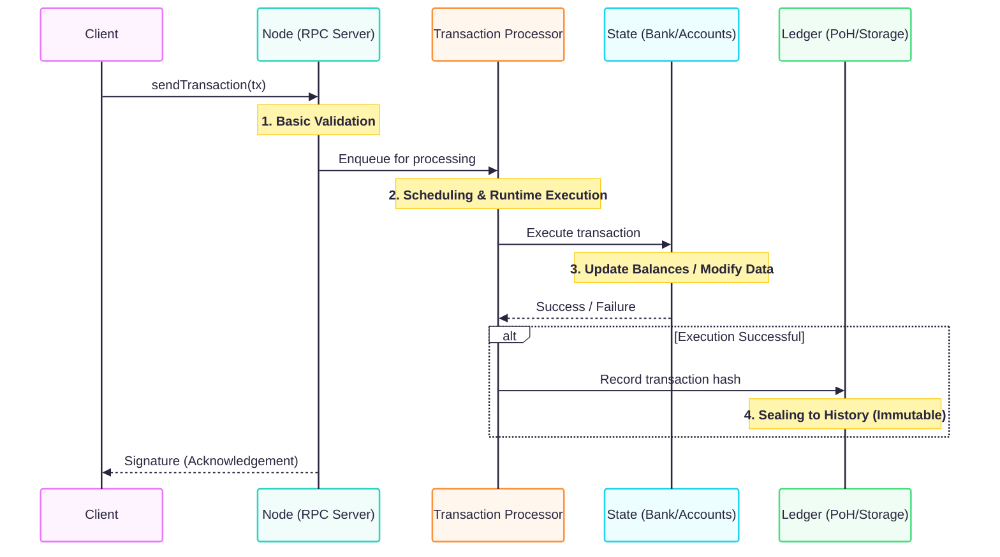
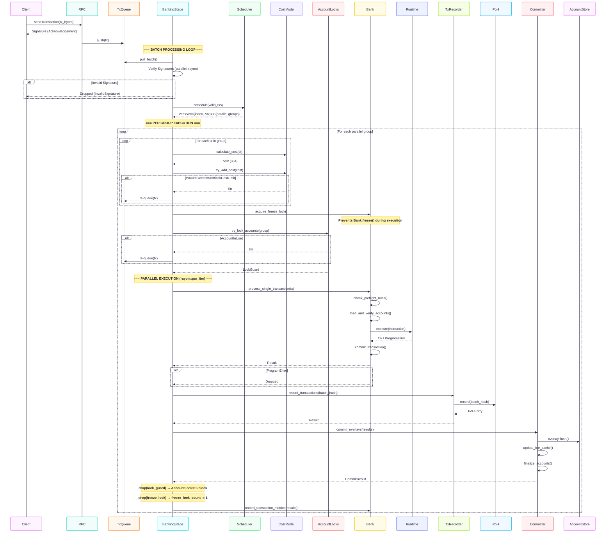

### tiny-solana

solana deep dive (took ~1.5 week)  
validator / consensus client implementation. was studying agave so not from scratch  

thought about implementing both tokio ingress and af_xdp ingress and sending it to our internal channel (ingress layer -> channel layer -> processing layer)  
but we have to copy data - losing af_xdp advantages  
or maybe can use raw pointers but have to implement arena allocator with free_list or smth... so decided to take simpler approach and use tokio without any abstractions  

using parking_lot cuz lazy to handle poison errs but in 2026 there is no huge difference with std rwlock in benches  

block-stm in sui looks fun, wanna study it later  

## features
- creating a tx queue in `main.rs`, handle batches in `BankingStage`
- using bincode with `with_fixint_encoding` to achieve determinism
- an account store trait with memory/overlay(cow)/rocksdb implementations, but no support for blockstore yet (only current accounts state)
- proof of history ticking
- transaction retrying if possible
- a simple cost model
- a runtime with a native loader - system program (`Transfer` `Assign` `CreateAccount`  ), token program (`Mint` `Transfer` `SetAuthority` `InitializeMint` `InitializeAccount`)
- solana-rbpf to create bpf loader (`InitializeBuffer`, `Write`, `DeployWithMaxDataLen`, `Upgrade`, `SetAuthority`, `Close`) but don't have enough registered syscalls yet
- `ChainedProgramExecutor` combining `NativeProgramExecutor` and `RbpfProgramExecutor`
- making own vm is out of scope
- simple rpc with axum
- custom `TrackedRwLock` wrapper 
- parallel transactions executing (`sealevel`) - tx grouping, account locking, bank freeze counter
- blockhash queue
- cpi (Cross-Program Invocation) with `invoke_context`
- tx custom manual serialization and deserialization (bincode and repr c not enough) 

## not implemented
- bank forks (basically a `DashMap<Slot, Arc<Bank>>` but have to refactor)
- only leader-only mode, no validator mode
- metrics
- Program Derived Addresses (PDAs)
- no gossip, no turbine, no quic
- snapshots
- rent collection
- priority fees

## architecture

high-level


detailed execution flow


## run
`cargo run --bin keygen`  
`$env:RUST_LOG="debug"; cargo run --bin tiny-solana`  
`cargo run --bin client`  

```
faucet: 5nbVsRG8VCpcoaod1nmnyWgV4Bv47RQChLLnFRui62gB
recipient: 7maCHzw4GLxhuBRpNUaYDDYrfELozgmF8tXFRnNSTX7D
latest blockhash: 11111111111111111111111111111111
sending transaction
response: Object {"id": Number(1), "jsonrpc": String("2.0"), "result": String("8uzuqRvkjsnmJoJqQDoSW2oeHDHsFkm4Es11Mou4GZmBAX4Z9akPL8zW5MnLRFhWS3NDk9Cd71B9wUDUQFqtk5N")}
transaction sent, signature: 8uzuqRvkjsnmJoJqQDoSW2oeHDHsFkm4Es11Mou4GZmBAX4Z9akPL8zW5MnLRFhWS3NDk9Cd71B9wUDUQFqtk5N
waiting for confirmation
faucet balance: 999999000000 lamports
recipient balance: 1000000 lamports
```